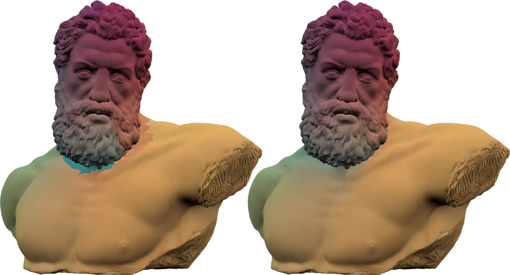
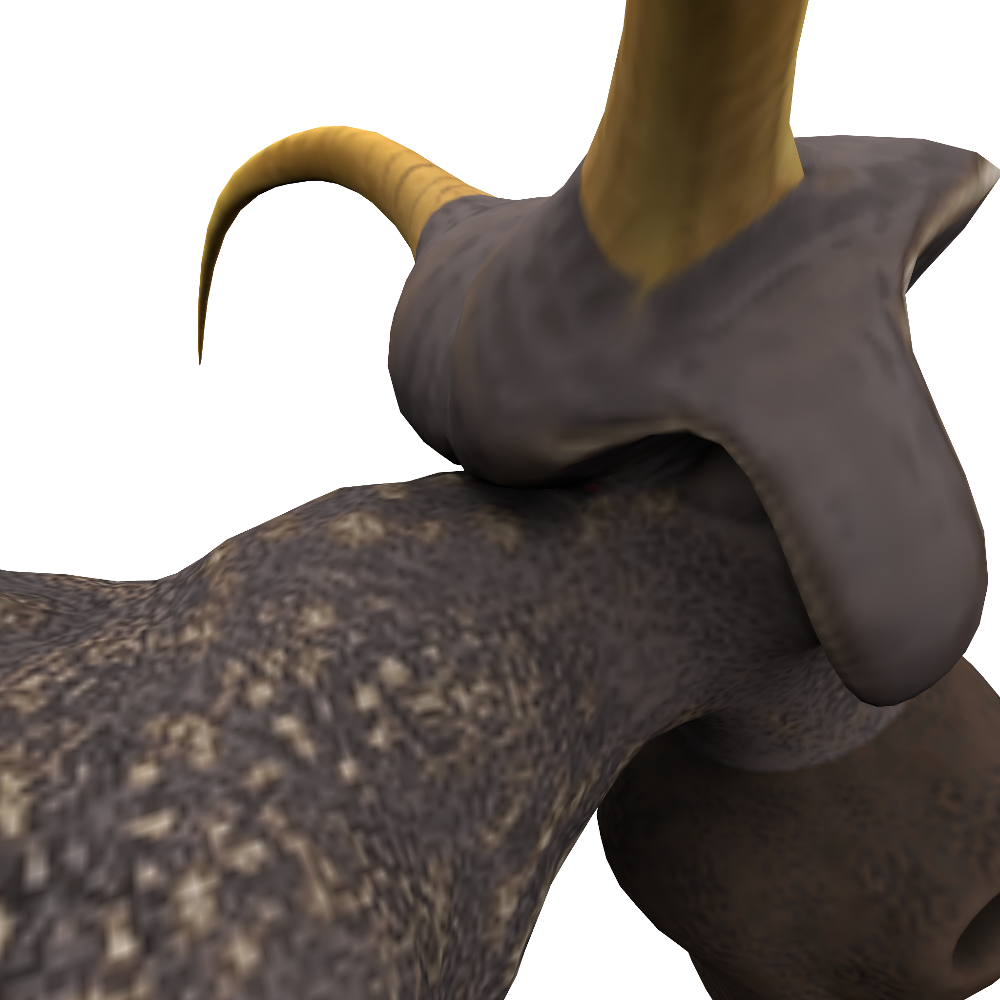
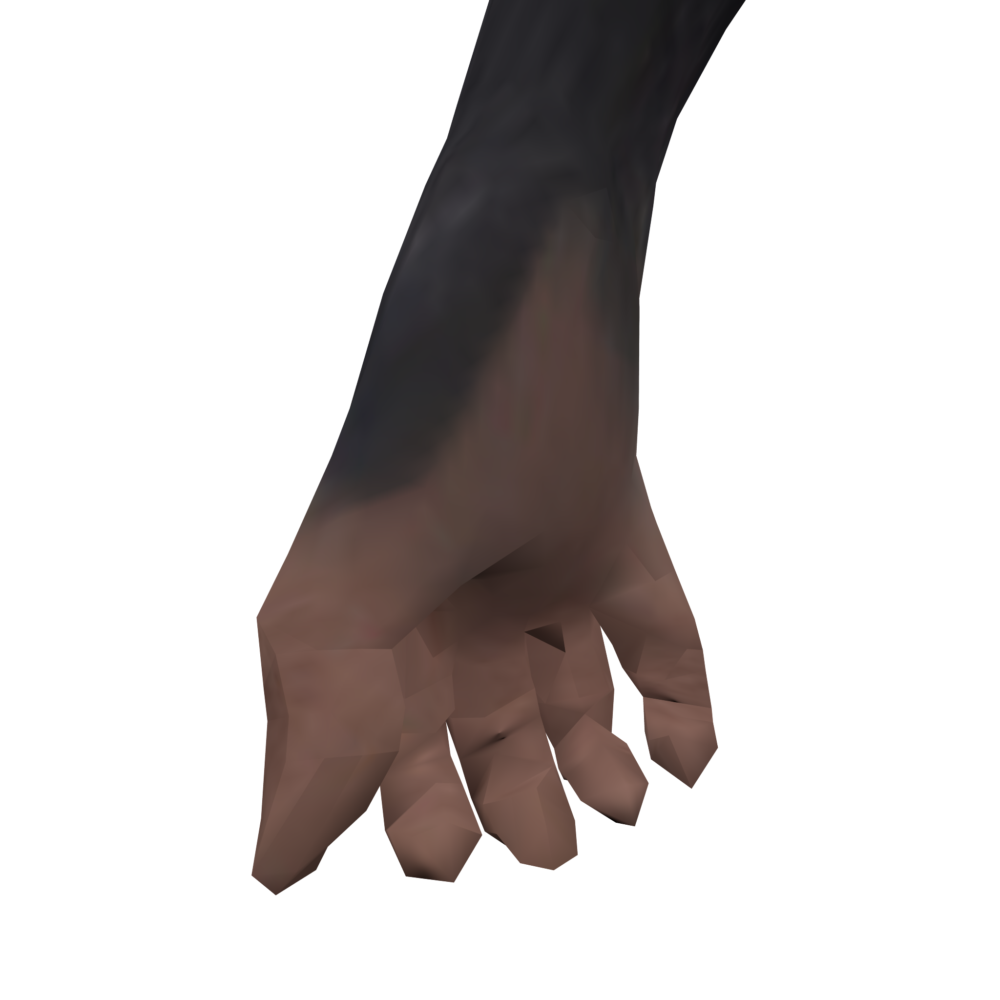
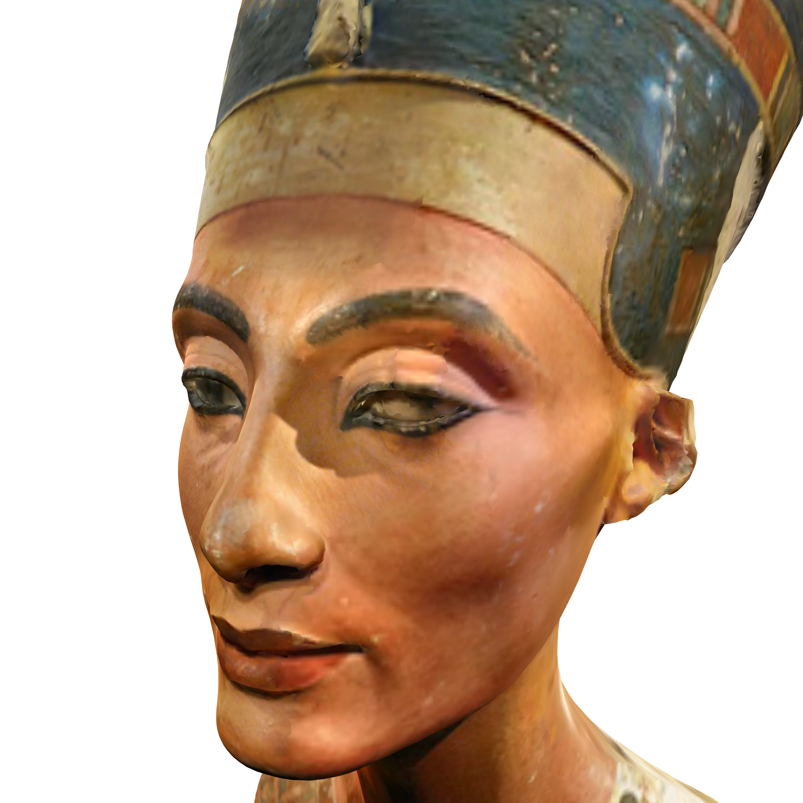
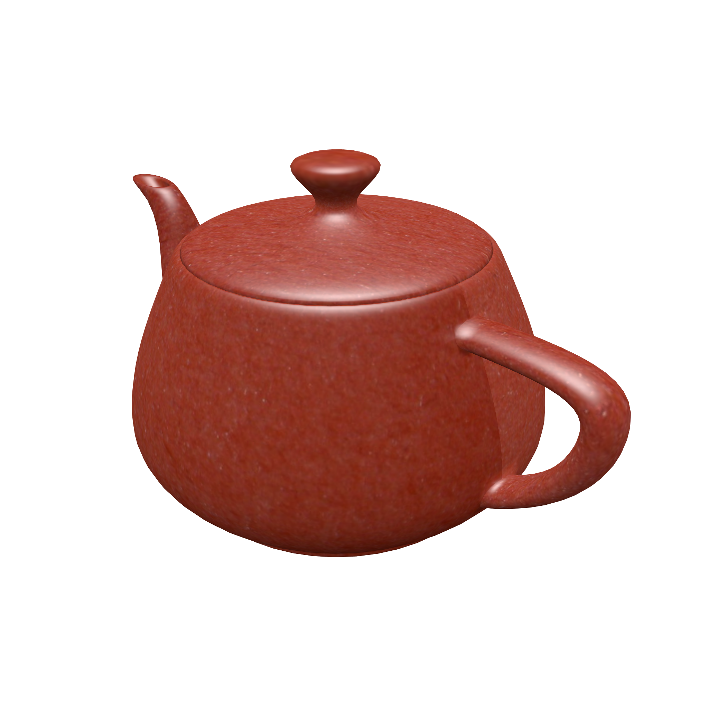
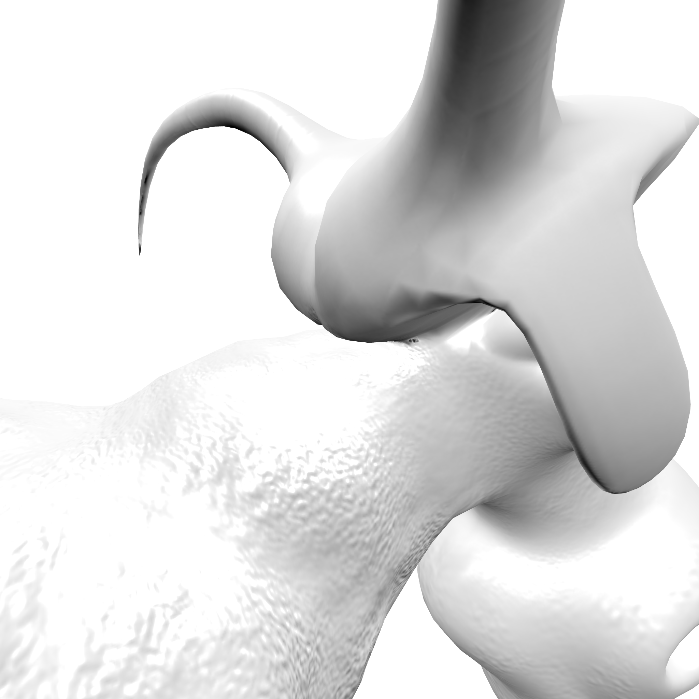
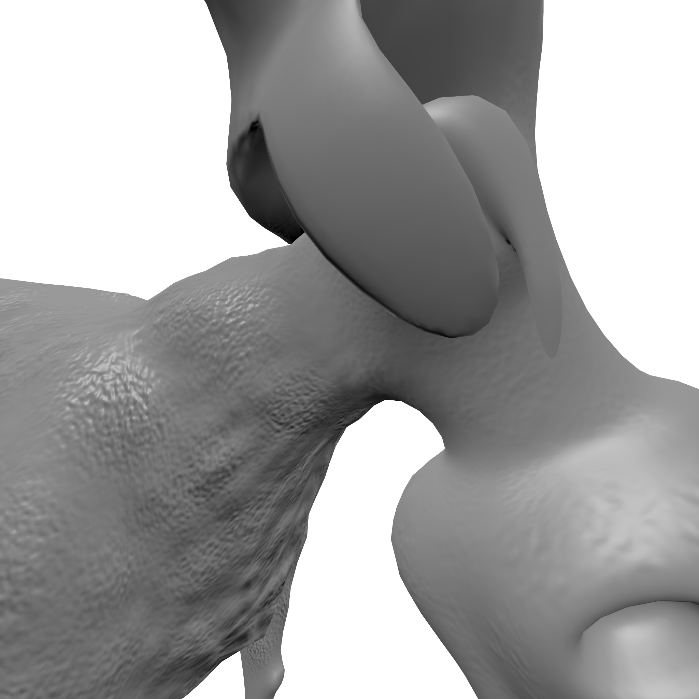
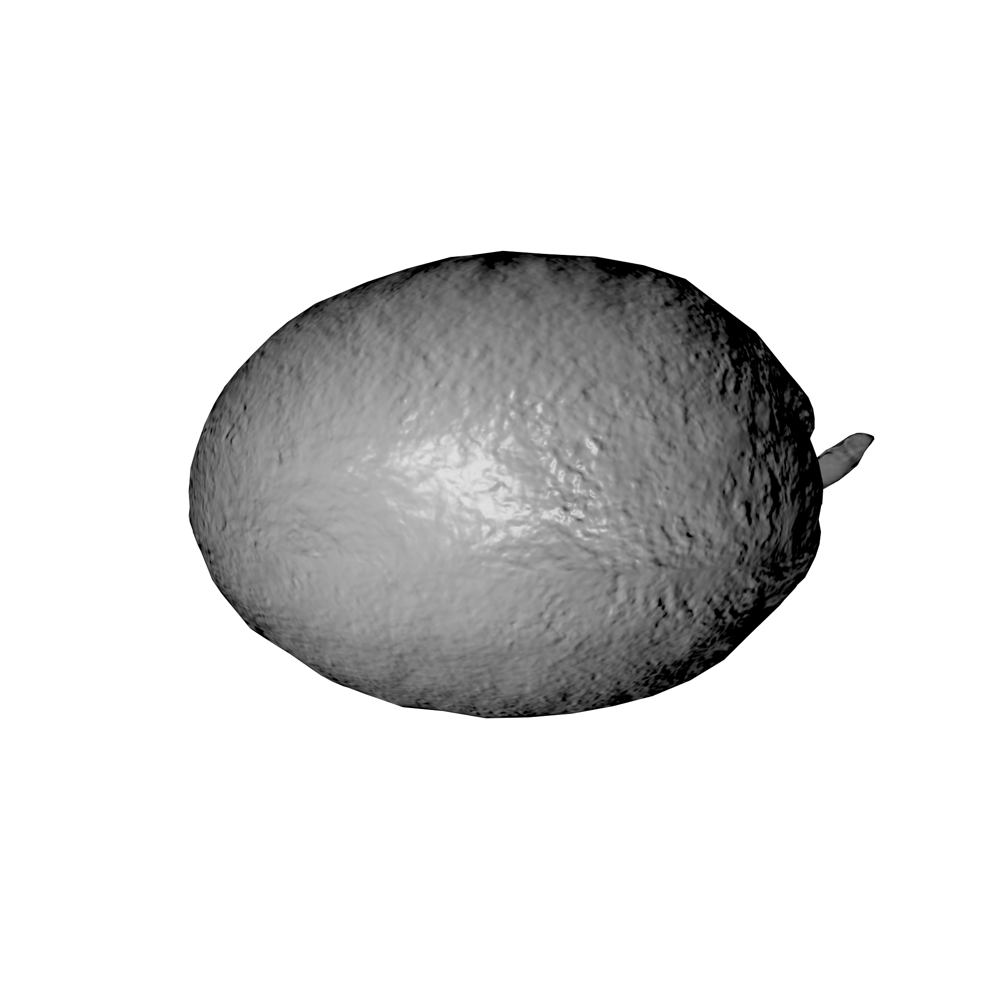
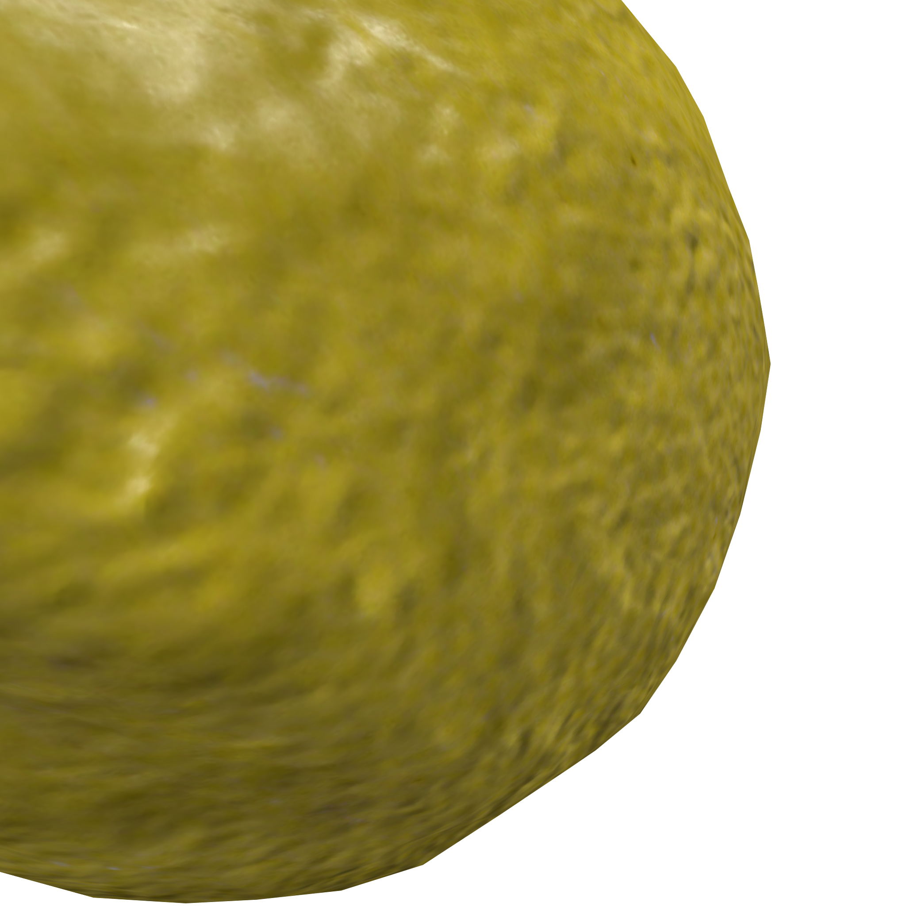

# Seam Erasure
Erases texture seams to prevent visible seams or tearing in displacement maps.

## Overview

Seams of a textures often produce errors when bi-linearly interpolated. This
results in a visible seam line or other undesired artifacts. The goal of this
project is to devise a numerical solution to this problem by minimizing the
energy/error between edge pairs.

This repository contains a release candidate for the development version found 
[here](http://github.com/zfergus/seam-erasure-dev). See the Seam-Erasure-Dev 
repository for the latest and expiermental developments.



## Requirements

This repository is designed for Python 2, but it should be compatible with
Python 3 as well.

Python libraries: (`sudo pip[3] install <package-name>`)
* recordclass - simple data objects
* scipy - sparse matrix operations
* numpy - linear algebra
* pillow - saving/loading texture image files

### Installation

Install for Python 2.x/3.x:

```bash
sudo apt-get install python[3]-dev python[3]-pip
sudo -H pip[3] install numpy scipy pillow recordclass
```

## Usage

To use the seam eraser tool first install the required packages. Then
enter the following into a cmd-line:

```bash
python ./src/main.py path/to/input_model path/to/input_texture [-h] [-o path/to/output_texture] [-d] [-m {weighted,nullspace,mosek}] [--sv {none,texture,lerp}] [-g]
```

## Files

* `server.py` - Flask based python code for handling web inputs.
* `SeamErasure/` - Python package for Seam-Erasure
    * `SeamErasure/main.py` - Command-line interface for seam erasure.
* `static/` - Static web page content including style sheets
* `templates/` - HTML template pages

## Results

### Diffuse Textures

| Before | After |
|:------:|:-----:|
|     |     |
|      |      |
|     |     |
|     |     |

### Normal Maps

| Before | After |
|:------:|:-----:|
|  |  |
|   |   |
|   |   |
|   |   |

### Ambient Occlusion

| Before | After |
|:------:|:-----:|
|  |  |

### Geometry Images

| Before | After |
|:------:|:-----:|
|  |  |
|   |   |
