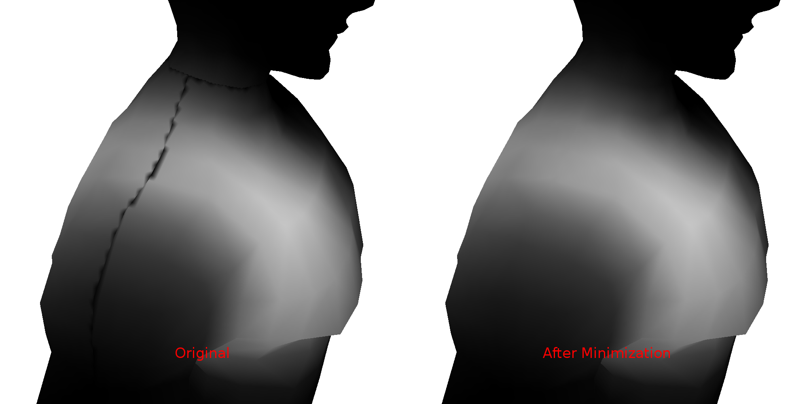
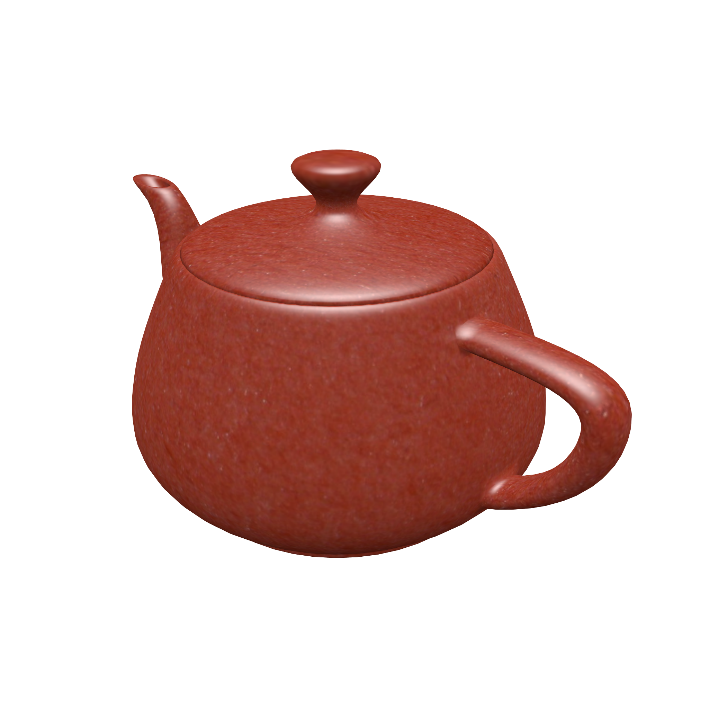
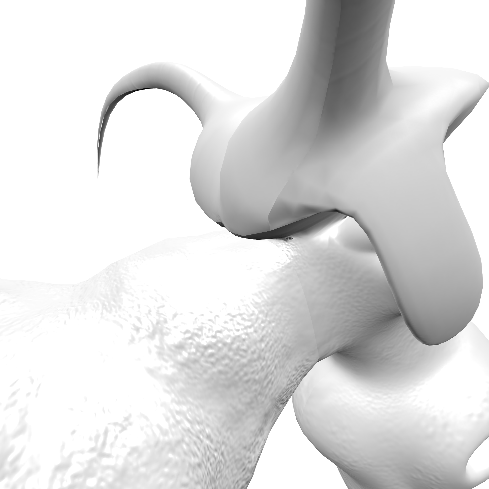
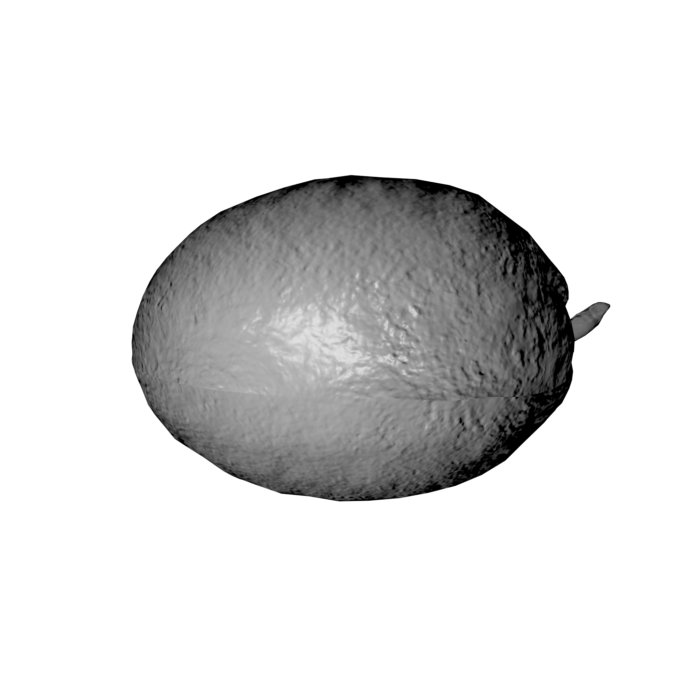
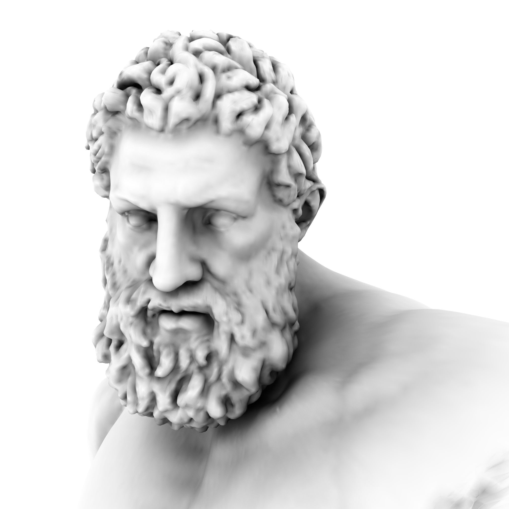
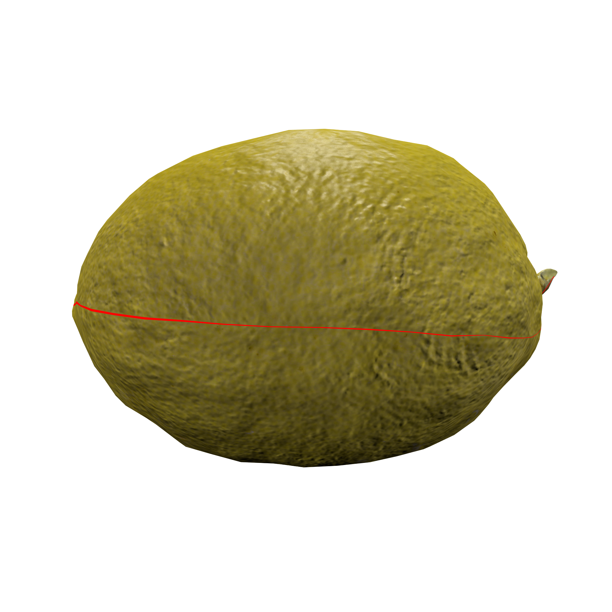
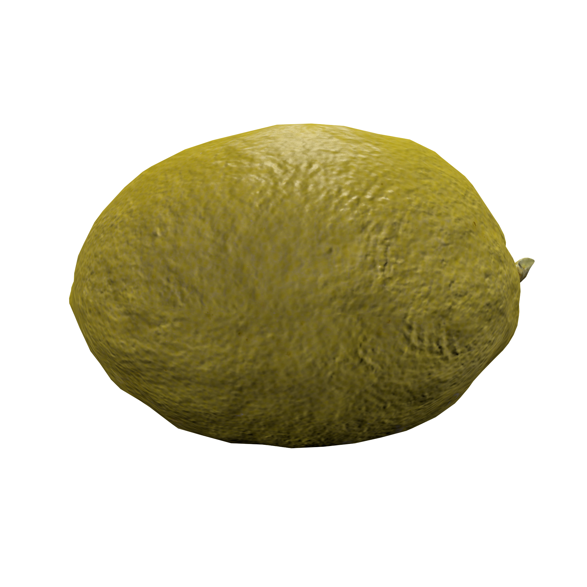
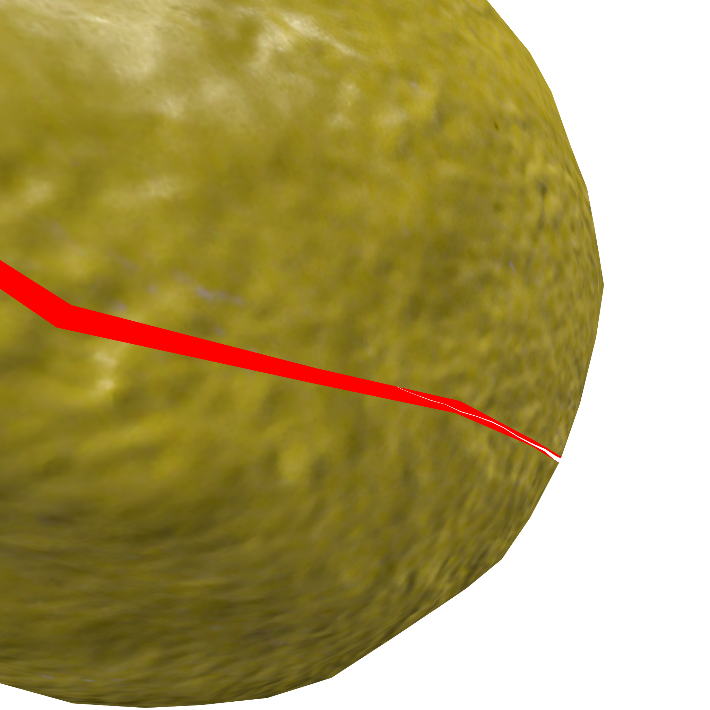

# Energy Minimization of Bilinearly Interpolated Edges
Energy minimization of texture seams to prevent visible seams or tearing in
displacement maps.

## Overview

Seams of a textures often produce errors when bilinearly interpolated. This
results in a visible seam line or other undesired artifacts. The goal of this
project is to devise a numerical solution to this problem by minimizing the
energy/error between edge pairs.



## Requirements

This repository is designed for Python 2, but it should be compatible with
Python 3 as well.

Python libraries: (`sudo pip[3] install <package-name>`)
* recordclass - simple data objects
* scipy - sparse matrix operations
* numpy - linear algebra
* pillow - saving/loading texture image files
* [cvxopt](http://cvxopt.org/install/) - inequality constrain QP solver (Optional)


PySPQR (Sparse QR Decomposition)
* See repository [here](https://github.com/yig/PySPQR/)
* To install this repository do one of the following:
    * Use `--recursive` when cloning this repository
    * Clone PySPQR into `lib/PySPQR`
        * `git clone git@github.com:yig/PySPQR.git ./lib/PySPQR`
* Requires:
    * SuiteSparseQR (`sudo apt-get install libsuitesparse-dev`)
    * cffi (`sudo pip install cffi`)
* See **Debugging PySPQR** for more information

<!-- (Optional) Mosek qp solver for Python:
* Download the required package [here](https://mosek.com/resources/downloads)
* Installation instructions:
    * [Linux](http://docs.mosek.com/7.1/toolsinstall/Linux_UNIX_installation_instructions.html)
    * [MacOS](http://docs.mosek.com/7.1/toolsinstall/Mac_OS_X_installation.html) -->

### Installation

<!-- Prerequisites:

```bash
sudo apt-get update
sudo apt-get install liblapack-dev libblas-dev gfortran libjpeg8-dev
``` -->

Install for Python 2.x/3.x:

```bash
sudo apt-get install python[3]-dev python[3]-pip
sudo pip[3] install numpy scipy pillow recordclass cvxopt
```

### Debugging PySPQR

The PySPQR library should compile automatically when running the main python
code. If you run into import errors during compilation, change lines 11-15 in
./lib/PySPQR/spqr_gen.py to the following:

```python
ffibuilder.set_source( "_spqr",
    """#include <SuiteSparseQR_C.h>""",
    include_dirs = ['/usr/include/suitesparse'],
    libraries=['spqr'])
```

## Usage

To use the seam minimization tool first install the required packages. Then
enter the following into a cmd-line:

```bash
python ./src/main.py path/to/input_model path/to/input_texture [-h] [-o path/to/output_texture] [-d] [-m {weighted,nullspace,mosek}] [--sv {none,texture,lerp}] [-g]
```

<!-- (The order of energies in the nullspace method can be changed by rearranging
the order of the lists in `seam_minimizer.py` lines 190 and 193.) -->

## Files

* `src/` - python source code files
    * `src/main.py` - CMD-line tool for running the minimizer
* `lib/` - library files not exclusive to this project
    * `lib/PySPQR/` - Wrapper around SuiteSparse's SPQR Decomposition
* `tools/` - visualization tools
* `models/` - sample OBJ model files
* `textures/` - textures for provided models
* `math/` - Derivations for Bilinear, Seam Gradient, and Seam Value Energies

## Results

### Diffuse Textures

| Before | After |
|:------:|:-----:|
|     |     |
|      |      |
|     |     |
|     |     |

### Normal Maps

| Before | After |
|:------:|:-----:|
|  |  |
|   |   |
|   |   |
|   |   |

### Ambient Occlusion

| Before | After |
|:------:|:-----:|
|  |  |

### Geometry Images

| Before | After |
|:------:|:-----:|
|  |  |
|   |   |
